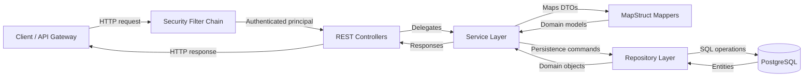
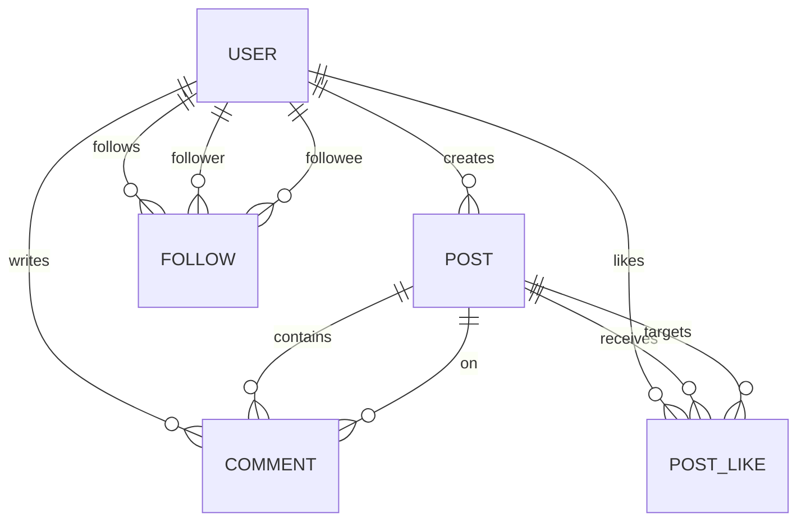
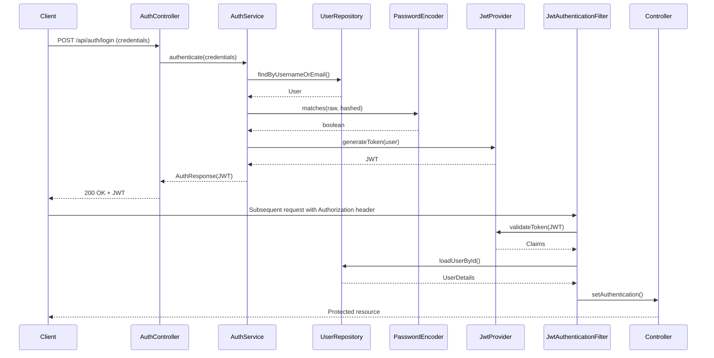

# Architecture Overview

This document describes the layered design of the Fakebook backend, outlines the primary domain entities, and explains how HTTP requests traverse the system. Each Mermaid diagram is stored as a standalone source file in [`docs/diagrams`](./diagrams) so they can be regenerated with tools such as [`@mermaid-js/mermaid-cli`](https://github.com/mermaid-js/mermaid-cli):

```bash
npx @mermaid-js/mermaid-cli -i docs/diagrams/component-interactions.mmd -o docs/diagrams/component-interactions.svg
```

## Layered Architecture

The application is structured into clear layers that keep responsibilities isolated:

- **Controller layer** (`com.example.fakebook.controller`) exposes REST endpoints, handles request validation, and coordinates pagination and response codes.
- **Service layer** (`com.example.fakebook.service`) contains transactional business logic for posts, follows, likes, and comments. It orchestrates repositories and DTO mapping.
- **Mapper layer** (`com.example.fakebook.mapper`) leverages MapStruct to convert between entities and DTOs so controllers stay presentation-focused.
- **Repository layer** (`com.example.fakebook.repository`) uses Spring Data JPA to abstract persistence operations against PostgreSQL.
- **Security layer** (`com.example.fakebook.security`) wires JWT authentication, request filtering, and `UserDetails` loading.
- **Infrastructure/configuration** (`com.example.fakebook.config`, `com.example.fakebook.exception`) centralizes cross-cutting concerns including exception translation and web configuration.



## Key Domain Entities

The JPA entities under `com.example.fakebook.entity` model the social network:

- `User` represents members with credentials, profile data, and a collection of authored posts.
- `Post` captures user-generated content with optional images and aggregates `Comment` and `PostLike` records.
- `Comment` links users to posts with message content and timestamps.
- `PostLike` implements a composite key (`PostLikeId`) to track which user liked which post.
- `Follow` models directed follow relationships using a composite key (`FollowId`) that pairs follower and followee IDs.

Their relationships are summarized below:



## Request Flow

1. **Inbound request** – HTTP clients (or an upstream API gateway) call the REST API. Requests enter the Spring Security filter chain, where `JwtAuthenticationFilter` inspects the `Authorization` header.
2. **Authentication** – If a JWT is present, it is validated, user details are loaded, and the security context is populated before the request reaches controllers.
3. **Controller handling** – Controllers (e.g., `PostController`, `AuthController`) validate input DTOs and invoke the appropriate service methods.
4. **Business processing** – Services enforce business rules, coordinate MapStruct mappers, and interact with repositories. Transactions ensure data integrity.
5. **Persistence** – Repositories translate service calls into JPA queries executed against PostgreSQL.
6. **Response** – Services map entities back to DTOs, controllers return structured JSON, and any exceptions are converted into standardized error payloads.

The authentication journey is captured in the following sequence diagram:



## Updating the Diagrams

1. Modify the relevant `.mmd` file in [`docs/diagrams`](./diagrams).
2. Regenerate the output format you need using Mermaid tooling, for example:

   ```bash
   npx @mermaid-js/mermaid-cli -i docs/diagrams/authentication-sequence.mmd -o docs/diagrams/authentication-sequence.svg
   ```

3. Commit the regenerated assets alongside the updated source files.

These textual sources keep diagrams version-controlled and easy to review.
